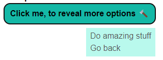

# Dropdown Menu without any external library

[Working demo](https://tesar-tech.github.io/BlazorAndTailwind/dropdownmenu)

## Pure CSS (Tailwind) dropdown


Decent solution for simple dropdown exists. The magic is in `focus-within` css pseudo selector, which can be easily used with tailwind:

```html
<div class="group relative inline-block p-3 ml-7">
  <button type="button" class="border-neutral-600 border px-1 rounded-md">...</button>

  <div class="absolute left-0 top-10 flex min-w-max flex-col rounded-md border border-neutral-500 bg-neutral-100 px-2 py-1 
              invisible group-focus-within:visible group-active:visible">
    <div class="cursor-pointer hover:underline">Do amazing stuff</div>
    <div class="cursor-pointer hover:underline"> Go back</div>
  </div>
</div>
```

[Live demo on play.tailwindcss.com](https://play.tailwindcss.com/xSihfwdQuZ)

### How does that work?

- The container has class `group`. Using this, we can affect other elements inside that div.
- Second line of classes of the menu has `invisible group-focus-within:visible group-active:visible`
  - it is invisible unless the focus is within element where the class `group` is set.
  - `group-active:visible` is necessary for items to be actually clickable (??)
- Position is set to relative for outer div. For inner one (the menu) is set to absolute, so menu will always appear under the button.
- When you click the button, outer div got focused, thus menu gains visibility.
  - When you click somewhere else, focus is lost and menu will disappear.

### What's the problem here?

- The only issue I have with this simple approach is clicking the button for the second time.
- I would like the menu to be closed when opened and clicked.
- This is the reason why some C# code is necessary.

## Blazor and simple dropdown

- To ensure the menu is closed, when clicking the button for the second time, we have to add some C# code
- I came up with this:

```razor
<div class="group relative inline-block p-3 ml-7"
   @onfocusout="()=> alreadyClicked=false">
  <button type="button" class="border-neutral-600 border px-1 rounded-md"
  @onclick="@(()=>{ if(alreadyClicked==true) alreadyClicked=isVisible=false;else alreadyClicked=isVisible=true;})"
  >...</button>

  <div class="absolute left-0 top-10 flex min-w-max flex-col rounded-md border border-neutral-500 bg-neutral-100 px-2 py-1 
              invisible  @(isVisible?" group-focus-within:visible group-active:visible":"")">
    <div class="cursor-pointer hover:underline">Do amazing stuff</div>
    <div class="cursor-pointer hover:underline"> Go back</div>
  </div>
</div>

@code
{
    private bool isVisible;
    private bool alreadyClicked;
}
```


- Two boolean fields: `isVisible` and `alreadyClicked`.
- `@onclick` button event:
  - When clicked for the **first** time, visibility is set to true, same as the `alreadyClicked` flag.
  - When clicked for the **second** time, visibility is set to false and the `alreadyClicked` flag is reset.
- `isVisible` is used as second condition for the `group-focus-within:visible group-active:visible` classes.
- When outer container loses focus, `alreadyClicked` is set to false to ensure setting visibility to true when clicking next time on the button.

## DropdownMenu Component

- We can easily abstract all the parts into the component. The simplest usage will look like this:

```razor
<DropdownMenu>
    <div class="cursor-pointer hover:underline">Do amazing stuff</div>
    <div class="cursor-pointer hover:underline"> Go back</div>
</DropdownMenu>
```

- `RenderFragments` for items and for button content were added. This is full source code of the component:

```razor
<div class="group relative inline-block p-3 ml-7"
     @onfocusout="()=> alreadyClicked=false">
    <button type="button" class="@CssButton"
            @onclick="@(()=>{ if(alreadyClicked==true) alreadyClicked=isVisible=false;else alreadyClicked=isVisible=true;})">
        @if (ButtonContent == null)
        {
            <text>...</text>
        }else
        {
            @ButtonContent
        }
    </button>

    <div class="absolute @CssItemsCointainer
              invisible  @(isVisible?" group-focus-within:visible group-active:visible":"")">
        @if (ChildContent != null)
        {
            @ChildContent
        }
    </div>
</div>

@code
{
    private bool isVisible;
    private bool alreadyClicked;
    [Parameter] public RenderFragment? ButtonContent { get; set; }
    [Parameter,EditorRequired] public RenderFragment? ChildContent { get; set; }
    [Parameter] public string CssButton { get; set; } = "border-neutral-600 border px-1 rounded-md";
    [Parameter] public string CssItemsCointainer { get; set; } = "left-0 top-10 flex min-w-max flex-col rounded-md border border-neutral-500 bg-neutral-100 px-2 py-1";
}
```

- With that, we can customize button content, its css and css of the container. For example:

    

```razor
<DropdownMenu CssButton="px-3 py-2 font-bold bg-teal-500 rounded-xl"
              CssItemsCointainer="top-12 right-0 flex min-w-max flex-col bg-teal-200 px-2 py-1 animate-pulse">
    <ButtonContent>
        Click me, to reveal more options 🔨
    </ButtonContent>
    
    <ChildContent>
    <div class="cursor-pointer hover:underline">Do amazing stuff</div>
    <div class="cursor-pointer hover:underline"> Go back</div>
    </ChildContent>
</DropdownMenu>
```

## Alternatives/Research

- [Tailwind-elements dropdown](https://tailwind-elements.com/docs/standard/components/dropdown/)
  - js script is necessary to have functional dropdown
  - uses own css classes (tailwind-elements plugin)
- A lot of other Tailwind component libraries... [Flowbite](https://flowbite.com/docs/components/dropdowns/#), [TailwindUI](https://tailwindui.com/components/application-ui/elements/dropdowns),..
  - All require some sort of js library.
- [Dropdown menu without js](https://stackoverflow.com/questions/10468554/dropdown-menu-without-javascript) (SO question)
  - Old, but may be inspirational
  - Works with `onhover`, also with touch, but the issue with not closing the menu when button is pressed (touched) the second time is present.
- [BlazorContextMenu](https://github.com/stavroskasidis/BlazorContextMenu)
  - This may be the way to go!
  - Supports complex scenarios. For example, sub-items.
  - Another dependency in your project.
    - Necessary to import js a css file.
    - Css is customizable.
- [Using customized checkbox](https://css-tricks.com/the-checkbox-hack/)
  - This also may be viable solution
  - I didn't test it, it feels much hackier than current solution. 

