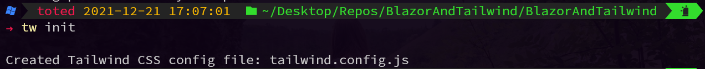
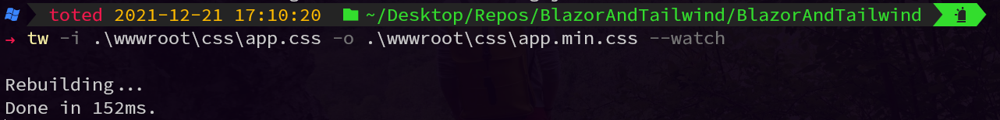

# Blazor and Tailwind CSS

Blazor is great and Tailwind CSS makes styling bearable.

In version 3 of Tailwind CSS, the setting for Blazor app got much easier, because a brand new standalone tailwind CLI has been released. **No need for npm to be installed**.

These notes may be useful for anyone who would like to test the Blazor&Tailwind combo.

## List of contents

- Setup and usage (this README file)
- DropdownMenu - [more info](Articles/DropdownMenu), [demo app](https://tesar-tech.github.io/BlazorAndTailwind/dropdownmenu).

  

(Let me know about your own experience, project or idea using PR, issue or [Twitter PM](https://twitter.com/tesar_tech))

## Quick guide (windows)

- [Download](https://github.com/tailwindlabs/tailwindcss/releases) `tailwindcss-windows-x64.exe`
- Rename file to `tw` (not necessary, but makes life easier)
  - or you can add the location to Path variable in windows (like I did)
- Open terminal in root of your project and: `./tw.exe init`, this creates `tailwind.config.js`

- Inside the `tailwind.config.js` file insert this code below. It will watch for all HTML and razor files. Whenever a new tailwind class appears in them, tailwind CLI will re-generate your `app.min.css` file (more in next step)

    ```js
    module.exports = {
    content: [
        './**/*.html',
        './**/*.razor',
    ],
    theme: {
    extend: {
        
        },
        },
    plugins: [],
    }
    ```

- add tailwind directives to app.css. (place it after any imports)

    ```css
    @tailwind base;
    @tailwind components;
    @tailwind utilities;
    ```

- Now run tailwind watch with:
`./tw -i .\wwwroot\css\app.css -o .\wwwroot\css\app.min.css --watch`

This takes your current CSS file (app.css), prepends its content to generated tailwind classes, and outputs `app.min.css` in the same folder.

- Now change the path in `index.html` (or `_Host.cshtml` for Blazor server) to use `app.min.css` instead of `app.css`. It will look like this:

    ```html
    <link href="css/app.min.css" rel="stylesheet" />
    ```

- Add some tailwind class to test the functionality. This will fill background with green color. On hover, text color will change to amber and will get bigger.

  ``` html
    <h1 class="bg-green-500 hover:text-amber-300 text-lg hover:text-2xl">Hello, world!</h1>
  ```

    

## Few notes and tips

- (Let me know yours by creating an issue!)
- For even quicker setting you can use CDN: `<script src="https://cdn.tailwindcss.com"></script>`
- [Tailwind playground]( https://play.tailwindcss.com/) is a great place to create prototypes. It is fast (you see changes instantly), vscode based and allows you to save your work.
- tailwind build process is rather quick, but sometimes leaves a mess inside the CSS file. For example, it will keep all the classes that were previously used (but are not used anymore)
  - You can delete the `app.min.css` file at any time (it will generate it again).
  - You should use minified version in production: `./tw -i input.css -o output.css --minify`
- Tailwind and bootstrap have some clashing CSS classes (px-2 for example). If you need to keep both (I have to, because I am using a component library, which is based on bootstrap) you can use [prefix](https://tailwindcss.com/docs/configuration#prefix) for tailwind classes.
- There is currently no tailwind package in the chocolatey package manager. You can vote for it [here](https://github.com/tailwindlabs/tailwindcss/discussions/6650).
- There is [this](https://github.com/tailwindlabs/tailwindcss-intellisense) a good extension for vscode, which brings pleasant experience from tailwind playground to your desktop. Just open root folder of your project (where the `tailwind.config.js` is).
- I had a bad experience with dotnet hot reload when CSS files are regenerated. It does weird things, like not updating (even after Ctrl+R), serving older versions, etc.. You can turn off hot reloading with: `dotnet watch --project . --no-hot-reload`. I am in the progress of finding a better solution. Anybody knows it already?
- If you want to build your CSS file every time you reload your project you can add the following into your `.csproj` file. You do have to change the command to set the input and output directories and the executable name and it should work. However it doesn't trigger on hot reloads so you have to reload manually.

    ```xml
    <Target Name="UpdateTailwindCSS" BeforeTargets="Compile">
      <Exec Command="./tailwindcss .\wwwroot\css\app.css -o .\wwwroot\css\app.min.css" ContinueOnError="true">
        <Output TaskParameter="ExitCode" PropertyName="ErrorCode"/>
      </Exec>
      <Error Condition="'$(ErrorCode)' != '0'" Text="Error building CSS file"/>
    </Target>
    ```
 - If you're developing on machines with different OSs, you can add the build script down below into your `.csproj` file, and have different scripts run based on your operating system. Make sure you modify the paths to actually work. I recommend trying them out in your terminal first. Also make sure you download both the Linux and Windows executable if you're jumping between systems.

    ```xml
    <Target Name="UpdateTailwindCSS" BeforeTargets="Compile">
      <!-- The code below runs only on Linux operating systems -->
      <Exec Command="./tailwindcss -i Styles/app.css -o wwwroot/css/app.css" Condition="$([MSBuild]::IsOSPlatform('Linux'))" ContinueOnError="true">
        <Output TaskParameter="ExitCode" PropertyName="ErrorCode"/>
      </Exec>

      <!-- The code below runs only on Windows operating systems -->
      <Exec Command=".\tailwindcss.exe -i Styles\app.css -o wwwroot\css\app.css" Condition="$([MSBuild]::IsOSPlatform('Windows'))" ContinueOnError="true">
        <Output TaskParameter="ExitCode" PropertyName="ErrorCode"/>
      </Exec>

      <Error Condition="'$(ErrorCode)' != '0'" Text="Error building CSS"/>
    </Target>
    ```

