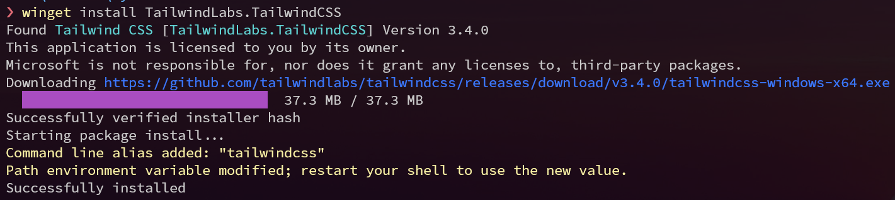
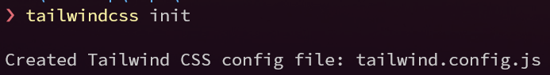
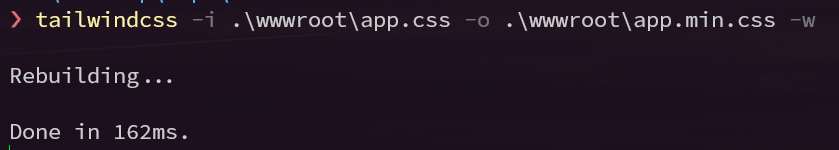

# Blazor and Tailwind CSS

Blazor is great and Tailwind CSS makes styling bearable.

These notes may be useful for anyone who would like to test the Blazor&Tailwind combo.

## Quick setup


- For a quick and easy way to experiment with Tailwind CSS in your Blazor project, simply incorporate Tailwind's [Play CDN](https://tailwindcss.com/docs/installation/play-cdn) link into your `index.html` (or `App.razor`) file. This approach offers a straightforward method to start using Tailwind without the need for extensive setup. Your integration would look something like this:
  ```html
   <script src="https://cdn.tailwindcss.com"></script>
  ```
  - Then just add the Tailwind classes to your HTML elements. For example:
  ```html
  <div class="bg-blue-500 text-white p-4">
    This is a Tailwind styled div.
  </div>
  ```
   - This approach is not suitable for production use. For a more robust solution, see the next section.


- You can use [tailwind cli](https://tailwindcss.com/docs/installation). It enables you to run tailwind withouth npm.
  - On Windows you can obtain it by `winget install -e --id TailwindLabs.TailwindCSS`
  
- Add this to your [app.css](./src/wwwroot/app.css) file.
  ```css
  @tailwind base;
  @tailwind components;
  @tailwind utilities;
  ```
- Add [`tailwind.config.js`](./src/tailwind.config.js) file to your project root. You can use `tailwindcss init` command to create it.
 
 - Add razor files to the `content` array:
  ```js
  module.exports = {
    content:
        [
            './**/*.razor',
            './wwwroot/index.html'
        ],
  }
  ```
- Run the `tailwindcss -i .\wwwroot\app.css -o .\wwwroot\app.min.css -w` where the `tailwind.config.js` resides.
  - (Note that `app.css` is directly in the `wwwroot` folder)
  
- Change the path in [`index.html`](./src/wwwroot/index.html) (or `App.razor` if you don't use standalone wasm app) to use `app.min.css` instead of `app.css`. It will look like this:
  ```html
  <link href="app.min.css" rel="stylesheet" />
  ```
- Don't including `app.min.css` in git, but rather use build action. Check [the pipeline](./.github/workflows/publish-to-gh-pages.yml) to see how to download and use tailwind cli in the pipeline.

## Other tips

- Tailwind Blazor loader (see [index.html](./src/wwwroot/index.html)):

  


## Few notes and tips

- (Let me know yours by creating an issue!)
- For even quicker setting you can use CDN: `<script src="https://cdn.tailwindcss.com"></script>`
- [Tailwind playground]( https://play.tailwindcss.com/) is a great place to create prototypes. It is fast (you see changes instantly), vscode based and allows you to save your work.
- tailwind build process is rather quick, but sometimes leaves a mess inside the CSS file. For example, it will keep all the classes that were previously used (but are not used anymore)
  - You can delete the `app.min.css` file at any time (it will generate it again).
  - You should use minified version in production: `./tw -i input.css -o output.css --minify`
- Tailwind and bootstrap have some clashing CSS classes (px-2 for example). If you need to keep both (I have to, because I am using a component library, which is based on bootstrap) you can use [prefix](https://tailwindcss.com/docs/configuration#prefix) for tailwind classes.
- There is currently no tailwind package in the chocolatey package manager. You can vote for it [here](https://github.com/tailwindlabs/tailwindcss/discussions/6650).
- There is [this](https://github.com/tailwindlabs/tailwindcss-intellisense) a good extension for vscode, which brings pleasant experience from tailwind playground to your desktop. Just open root folder of your project (where the `tailwind.config.js` is).
- (not an issue anymore) ~~I had a bad experience with dotnet hot reload when CSS files are regenerated. It does weird things, like not updating (even after Ctrl+R), serving older versions, etc.. You can turn off hot reloading with: `dotnet watch --project . --no-hot-reload`. I am in the progress of finding a better solution. Anybody knows it already?~~ 
- If you want to build your CSS file every time you reload your project you can add the following into your `.csproj` file. You do have to change the command to set the input and output directories and the executable name and it should work. However it doesn't trigger on hot reloads so you have to reload manually.

    ```xml
    <Target Name="UpdateTailwindCSS" BeforeTargets="Compile">
      <Exec Command="./tailwindcss .\wwwroot\css\app.css -o .\wwwroot\css\app.min.css" ContinueOnError="true">
        <Output TaskParameter="ExitCode" PropertyName="ErrorCode"/>
      </Exec>
      <Error Condition="'$(ErrorCode)' != '0'" Text="Error building CSS file"/>
    </Target>
    ```
 - If you're developing on machines with different OSs, you can add the build script down below into your `.csproj` file, and have different scripts run based on your operating system. Make sure you modify the paths to actually work. I recommend trying them out in your terminal first. Also make sure you download both the Linux and Windows executable if you're jumping between systems.

    ```xml
    <Target Name="UpdateTailwindCSS" BeforeTargets="Compile">
      <!-- The code below runs only on Linux operating systems -->
      <Exec Command="./tailwindcss -i Styles/app.css -o wwwroot/css/app.css" Condition="$([MSBuild]::IsOSPlatform('Linux'))" ContinueOnError="true">
        <Output TaskParameter="ExitCode" PropertyName="ErrorCode"/>
      </Exec>

      <!-- The code below runs only on Windows operating systems -->
      <Exec Command=".\tailwindcss.exe -i Styles\app.css -o wwwroot\css\app.css" Condition="$([MSBuild]::IsOSPlatform('Windows'))" ContinueOnError="true">
        <Output TaskParameter="ExitCode" PropertyName="ErrorCode"/>
      </Exec>

      <Error Condition="'$(ErrorCode)' != '0'" Text="Error building CSS"/>
    </Target>
    ```

